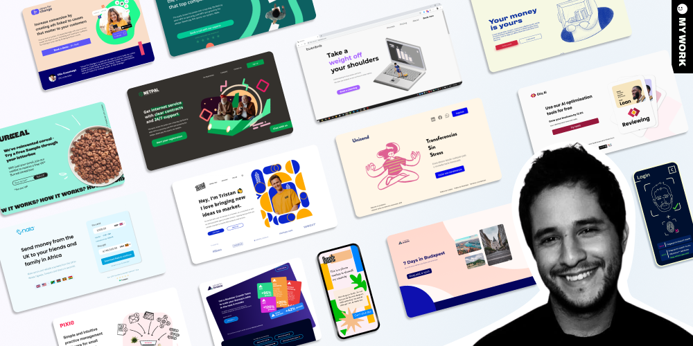

## Javi here 👋

<a href="http://enddesign.co/">
  
</a>

- [💻 About myself ](#-about-myself-)
- [🛠 My skillset ](#-my-skillset-)
- [🚀 Past clients ](#-past-clients-)

# 💻 About myself <a name="brief-portfolio"></a>
I'm a Web Developer with experience in Mechanical Engineering, Product Design and Marketing.
I run a design and development agency called [The End Design Co.](http://enddesign.co/) working on web apps for business applications

I'm available for new projects, feel free to reach out in case you believe I can help your business.
[Choose a convenient time for a 30-minute call here (Link to my Calendly)](https://ly.enddesign.co/intro) or send me an email at [javier@enddesign.co](mailto:javier@enddesign.co)


# 🛠 My skillset <a name="my-skillset"></a>
```
## Web Development
JS | TS | Python | Ruby | React | Next | Ruby on Rails | Unity ads

## Customization
Webflow | Wix | Unbounce

## Web Design + Frontend pipelines
Figma (Tokens, Autolayout & Design systems)
```
# 🚀 My clients <a name="clients"></a>

[Junction](https://www.hackjunction.com/)

[Tristan Gillen](https://www.tristangillen.com/)

[Alex Macintosh](https://www.alexmacintosh.com/)

[Growth Division](http://growth-division.com/)

[Growth DAO](https://www.growth-dao.com/)

[Musiversal](https://www.musiversal.com/)

[Ted’s Health](https://www.tedshealth.com/)

[Pixie](https://www.usepixie.com/)

[Little Bridge](https://www.littlebridge.com/)

[Etiq](https://etiq.ai/)

[Surreal](https://eatsurreal.co.uk/)

[The Product Refinery](https://www.theproductrefinery.com/)

...

You are visitor no:


<p></p>
